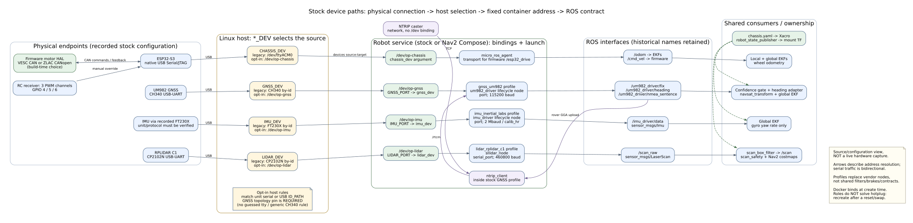
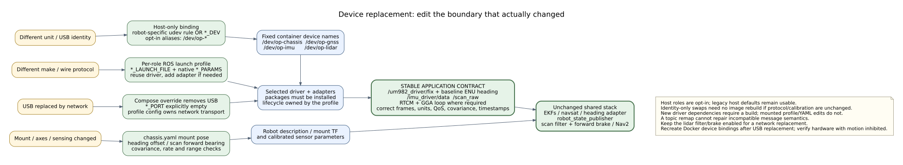

# Device connection paths and replacement boundaries

**Implementation snapshot:** 2026-09-11 UTC, through commit `007e889`.
This describes checked-in software/configuration, not a live robot inventory.
No robot deployment, host rule installation, serial connection or physical
performance test was performed. USB identities below are recorded defaults;
verify them on the actual host before adopting role aliases.

The implementation separates **host identity**, **container addressing**,
**driver/protocol selection**, and **mount/calibration**. A replacement should
change the relevant boundary, not force edits throughout the application.
The [ROS configuration guide](ros-configuration.md) covers the downstream node
graph and TF ownership in more detail.

## 1. Connection paths



[Editable Graphviz source](drawings/device-mapping/devices.dot).
These are addressing/connection paths, not a power-wiring schematic.
USB/serial links carry commands as well as telemetry. The motor controllers
and RC receiver terminate at the ESP32, not at Linux device nodes.

| Role | Recorded stock connection | Host source selection | Fixed deployment target | Software consumer |
|---|---|---|---|---|
| Chassis | ESP32-S3 native USB Serial/JTAG | `SERIAL_DEV`; legacy default `/dev/ttyACM0`, optional `/dev/op-chassis` | `/dev/op-chassis` | `micro_ros_agent`; exposes firmware `/odom` and `/cmd_vel` interfaces |
| GNSS | UM982 receiver over the recorded CH340 USB-UART | `GNSS_DEV`; legacy by-id default, optional `/dev/op-gnss` with an explicit topology pin | `/dev/op-gnss` | Selected GNSS profile; stock UM982 driver plus NTRIP |
| IMU | Recorded FT230X adapter, serial `DO01MCPU` | `IMU_DEV`; legacy by-id default or optional `/dev/op-imu` | `/dev/op-imu` | Selected IMU profile; stock `imu_driver` implements the Inertial Labs binary protocol |
| Lidar | RPLIDAR C1 over recorded CP2102N adapter, serial `f86253bee863ef11a2a1e2a9c169b110` | `LIDAR_DEV`; legacy by-id default or optional `/dev/op-lidar` | `/dev/op-lidar` | Selected lidar profile; stock `sllidar_node` |
| RTK corrections | NTRIP caster over IP/TCP | `NTRIP_PARAMS` selects an in-container config path | No `/dev` mapping | Stock GNSS profile closes the `/rtcm` and rover-GGA upload loop |

Exact compatibility defaults remain in the
[stock Compose](../../deploy/docker-compose.yaml) and
[Nav2 Compose](../../deploy/docker-compose.nav2.yaml). The
[canonical rule template](../../deploy/udev/99-outdoor-patrol.rules) contains
the recorded unit matches; the GNSS adapter has no unique serial in its
recorded by-id name, so the template deliberately requires a local `ID_PATH`.
It does not guess a tty number or match every CH340.

The ESP32's [motor-driver HAL](../../src/esp32-s3-uros-controller/firmware/main/motor_driver.h)
already separates wheel-side commands/feedback from a build-time choice of
two VESC controllers over custom CAN or one ZLAC8015D over CANopen.
[RC PWM capture](../../src/esp32-s3-uros-controller/firmware/main/rc_failsafe.h)
uses GPIO 4/5/6 for steering, throttle and mode. Replacing these backends is a
firmware task, not a Docker USB mapping change.

## 2. Package and container responsibilities

| Layer | Owns | Should not own |
|---|---|---|
| Host udev / local deployment settings | Match a physical unit or socket to a role; select a host source path | ROS topic names, vendor protocol decoding |
| Compose | Host source -> fixed container device; mounts; image; service environment/argv | Unit-specific assumptions inside driver code |
| [Bringup profiles](../../src/outdoor_patrol_bringup/README.md) | Select driver/executable, native YAML and any message adapters; lifecycle where applicable | Shared localization, sensor mount TF, the common lidar brake |
| Shared bringup/localization/safety | Robot description, timing, filter/brake, EKFs, navsat and heading adaptation | USB serial numbers or a particular vendor executable |
| Driver/firmware implementation | Wire protocol, units, device commands and feedback | Host USB enumeration order |

Both production Compose entry points use explicit device bindings, host
networking/IPC and Cyclone DDS. They must not run competing robot services
simultaneously. Nav2's recorder/server/mission services share the ROS graph,
not additional serial ownership.

The [multi-stage Dockerfile](../../deploy/Dockerfile) builds the workspace and
micro-ROS agent, then copies their install trees and resolves runtime manifest
dependencies. A new profile does not install a vendor driver by itself.
New driver/adapter dependencies need a build; mounted profile/YAML edits do
not, provided the required executable already exists in the image.

The [workstation](../../.devcontainer/devcontainer.json) and
[Orange Pi](../../.devcontainer/orangepi/devcontainer.json) devcontainers retain
their existing privileged, live `/dev` mounts. Host aliases therefore appear
without new passthrough entries, but these containers do **not** consume
Compose's `.env`. Their automatic rule setup remains optional/chassis-only.
The existing permissive dev access was not broadened or copied into production.

## 3. What changes during a replacement?



[Editable Graphviz source](drawings/device-mapping/replacement-seams.dot).

### Same protocol, same mount: identity only

For an immediate port-only replacement, change the relevant host `*_DEV`
setting and recreate the robot service. The driver still sees `/dev/op-*`.

For role-based operation, follow the
[opt-in installation procedure](../../deploy/README.md#opt-in-to-stable-host-roles):
copy the rule template, bind the GNSS to its actual USB topology or a unique
replacement serial, verify all recorded unit matches, then install/check the
host rules. Merge [`.env.example`](../../deploy/.env.example) into the existing
local configuration without losing NTRIP or data-directory settings.

Once adopted, a unit swap normally edits that one host mapping (a socket pin
may not need an edit if the connection stays equivalent). Legacy fallback
strings remain in Compose and standalone YAML for backward compatibility;
they are not the source used by an opted-in role deployment.

### Different make/model: profile and native parameters

Select `GNSS_LAUNCH_FILE`, `IMU_LAUNCH_FILE` or `LIDAR_LAUNCH_FILE` in deployment,
or the corresponding `*_launch_file` argument in the combined launch. Use
`*_PARAMS` / `*_params_file` for native ROS YAML. A profile is a small ordinary
ROS launch file, not a new generic driver-factory schema. Stock profiles reuse
the existing lifecycle drivers and retain the 12 s IMU / 8 s lidar timing.

The selected profile owns its defaults. Empty optional settings are carried
through **environment-backed launch defaults** by Compose; the ROS CLI rejects
an empty `name:=` token. Explicit non-empty CLI overrides still win.

Keep the existing data contracts, including historical topic names:

- `/um982_driver/fix`: `NavSatFix` with meaningful status/covariance and the
  correct antenna reference.
- `/um982_driver/heading`: baseline ENU `QuaternionStamped`, not compass
  degrees or course over ground.
- `/um982_driver/nmea_sentence` and `/rtcm`: preserve the required rover-GGA /
  correction loop if using NTRIP.
- `/imu_driver/data`: `Imu` with correct axes, rad/s, covariance and stamps;
  the global EKF currently uses gyro yaw rate only.
- `/scan_raw`: `LaserScan` compatible with `lidar_link`; the shared filter
  continues publishing `/scan` for safety and Nav2.

A topic remap cannot correct a message type, NED/ENU convention, unknown
covariance, invalid timestamp or QoS mismatch. Put necessary adapters in the
profile and validate the [full contract](../../src/outdoor_patrol_bringup/README.md#contract-for-a-replacement).
The IMU model mentioned in historical chassis comments is not proof of
compatibility with the checked-in Inertial Labs protocol implementation.

### USB -> network: change the container binding too

Use a profile with the new transport, remove the absent serial mapping, and
set the corresponding `*_PORT` environment variable explicitly empty.
The tested [network-lidar overlay](../../deploy/docker-compose.network-lidar.yaml)
retains the other three devices. It replaces the **entire** device list, so
maintain it when adding hardware. It requires Compose 2.24.4+ and a real
installed/mounted network driver profile; it does not implement that driver.
Keep `use_lidar=true` so the shared filter/brake remains enabled.

### Changed mount, axes or sensing characteristics: recalibrate

[chassis.yaml](../../src/outdoor_patrol_bringup/config/chassis.yaml) remains the
mount/geometry source consumed by the robot Xacro. That is not the whole
calibration: also check
[GNSS baseline yaw](../../src/outdoor_patrol_loc/config/heading_to_imu.yaml),
[raw-scan forward bearing and brake limits](../../src/outdoor_patrol_safety/config/scan_safety.yaml),
[body filtering](../../src/outdoor_patrol_bringup/config/scan_box_filter.yaml),
and native driver covariance/rate/handedness. The brake's current 180-degree
forward offset is not automatically recomputed from TF.

## 4. What the review changed

| Original problem | Implemented result |
|---|---|
| `GNSS_DEV` / `IMU_DEV` changed bindings but not the port opened by the node | End-to-end overrides; fixed container targets independent of host identity |
| Driver launch includes shared `params_file`, `port` and activation settings | Explicit, non-forwarding role scopes; independent GNSS/IMU lifecycle controls |
| Shared bringup selected vendor drivers directly | Replaceable per-role ROS launch profiles; native lidar YAML extracted |
| Unit identity spread into active mapping/configuration and inactive reference comments | Optional central host rules and role-based operation; legacy defaults deliberately retained for safe migration |
| A proposed simple role-path default flip would break hosts without rules | Opt-in host aliases; original host defaults continue to work |
| Empty optional settings rendered as invalid ROS CLI arguments during implementation | Environment-backed defaults plus real Compose -> ROS parser -> node-parameter tests |

The earlier review overstated a universal "five/six files per swap" count:
occurrences differed by device and included inactive devcontainer comments.
It also treated the IMU model/protocol identification as more certain than
the checked-in evidence supports. This document makes neither assumption.

## 5. Verification and remaining limits

- **84 targeted tests passed** with the completed implementation: 46 ROS
  graph/profile cases, 10 real Compose/ROS-CLI integration cases and 28
  deployment/installer cases. The installer tests use fake udev/sudo and
  temporary roots, not host `/etc` or robot devices.
- A targeted bringup build succeeded; all three nested profile launches and
  the lidar YAML were checked in the install tree. `--show-args`, targeted
  Python linters, shell syntax and udev rule syntax were also checked.
- No physical sensor, electrical compatibility, RTK lock, achieved rate,
  unplug/recovery sequence or motion behavior has been verified by this work.

Docker binds a device at container creation. Role symlinks do **not** provide
automatic hotplug recovery: after replacement/unplug/ESP32 reset, use
`up -d --force-recreate robot`, not just `docker restart`. Keep motion inhibited
while checking new device data, TF, quality and stopping behavior. The existing
scan brake blocks forward motion; it is not an all-direction or hardware
emergency-stop system.

For executable procedures and test commands, use the
[deployment guide](../../deploy/README.md) and
[profile guide](../../src/outdoor_patrol_bringup/README.md).

## Regenerating the diagrams

These are local Graphviz drawings, with no external rendering service:

```bash
for source in doc/eng/drawings/device-mapping/*.dot; do
  dot -Tsvg "$source" -o "${source%.dot}.svg"
done
```
