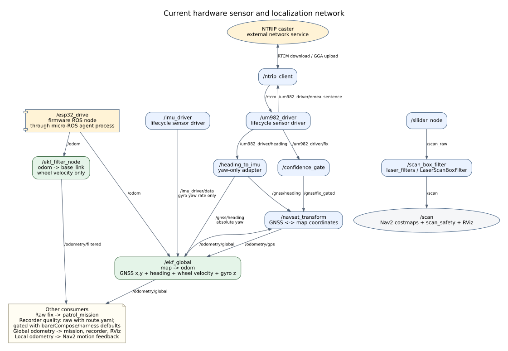
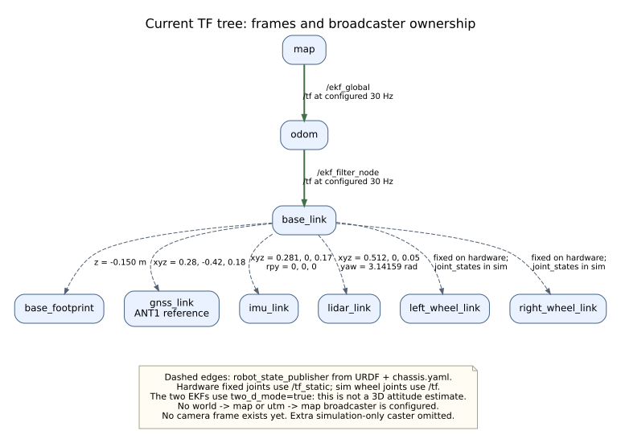
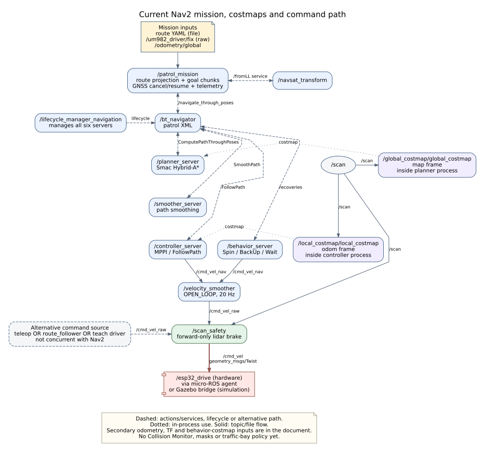
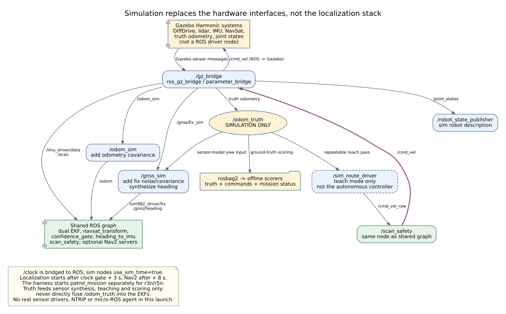

# Current ROS configuration and node network

**Source snapshot:** 2026-09-09 UTC, working tree on branch
`agents/nav2-driveway-field-test`, based on commit `dbd9cc9`.
**Hardware-boundary update:** 2026-09-11 UTC, through `007e889`: selectable
sensor launch profiles and role-based container mappings. The stock
node/topic/TF graph below remains unchanged; other sections retain the
original node-graph review.
**Platform:** ROS 2 Jazzy; Gazebo Harmonic for simulation.

This describes the **checked-in launch files, node implementations and YAML**,
not a live `ros2 node list` capture. The onboard PC is removed, so hardware
connectivity, running processes and achieved rates have not been checked.
The previous RK3588 deployment and scored simulation results are recorded in
[progress](plans/nav2-migration/progress.md). Jetson, camera depth/segmentation,
traffic yielding and the new stop-chain work remain
[planned changes](plans/nav2-migration/plan.md), not nodes in this graph.

The diagrams show application nodes and important interfaces. ROS-created
action-client/helper nodes and individual DDS action transport topics are
omitted. A ROS node, a process, a topic and a TF frame are different things:
the micro-ROS agent is a transport process; the firmware exposes `/esp32_drive`;
Nav2 costmap nodes live inside their controller/planner processes.

The hardware boundary below the driver nodes — physical device, USB bridge,
host `/dev` node, container mapping and the parameter each driver actually
opens — is documented separately in [Device connection paths and
mappings](device-mapping.md).

## 1. Which launch creates which graph?

| Entry point | What it actually starts | Important boundary |
|---|---|---|
| [Hardware `gnss_localization.launch.py`](../../src/outdoor_patrol_bringup/launch/gnss_localization.launch.py) | Stock profiles: agent, robot description/TF, UM982 + NTRIP, dual EKF, heading adapter, confidence gate, navsat transform; optional IMU, lidar/filter/brake and RViz | No route recorder or Nav2. Sensor profiles are replaceable; shared localization/filter/brake stay in bringup. IMU and lidar default on. |
| [Nav2 `nav2.launch.py`](../../src/outdoor_patrol_nav/launch/nav2.launch.py) | Six lifecycle servers plus `/lifecycle_manager_navigation` | No mission, sensor drivers, localization or `scan_safety`. Requires those separately. |
| [Simulation `sim.launch.py`](../../src/outdoor_patrol_sim/launch/sim.launch.py) | Gazebo, spawn helper, bridge, robot state publisher, odometry shim; GNSS shim, localization and brake default on | `nav:=false` by default. `nav:=true` adds servers **only**, not the mission. |
| [Route recording launch](../../src/outdoor_patrol_route/launch/route_record.launch.py) | `/route_recorder` | Consumes an existing localization graph; never drives. |
| [Validation harness](../../src/outdoor_patrol_sim/scripts/run_validation.sh) | Chooses the simulator/world, then starts teaching, follower or Nav2 mission and bag recording | `r3n`/`r5n` use `/patrol_mission`; legacy `r3`/`r4`/`r5` use `/route_follower`. There is no `r4n` case yet. |

### Hardware Compose composition

[docker-compose.nav2.yaml](../../deploy/docker-compose.nav2.yaml) uses
`outdoor-patrol:nav2`, host networking/IPC, Cyclone DDS and
`ROS_LOCALHOST_ONLY=0`. It does not set `ROS_DOMAIN_ID` (ROS default: **0**).
The host data directory is mounted at `/data`.

The robot service maps its selected host devices to `/dev/op-chassis`,
`/dev/op-gnss`, `/dev/op-imu` and `/dev/op-lidar`. Legacy host defaults remain
usable; host role aliases are an explicit opt-in. `*_PORT` and `*_PARAMS`
environment values supply optional launch defaults without invalid empty
ROS CLI arguments. See [device mapping](device-mapping.md) for the exact
host/container boundary and [profiles](../../src/outdoor_patrol_bringup/README.md)
for replacement contracts.

Compose profiles (`record`, `nav2`) select services. They are distinct from
the per-sensor ROS launch profiles selected with `*_LAUNCH_FILE`.

| Service / container | Profile | Entry point / selected configuration |
|---|---|---|
| `robot` / `outdoor-patrol-nav2` | default | Hardware GNSS launch, `use_rviz:=false`; serial and NTRIP paths supplied by Compose. |
| `recorder` / `outdoor-patrol-recorder-nav2` | `record` | Recorder, `source=odometry_global`; `/data/routes/${ROUTE_NAME:-driveway}.yaml`. Defaults: 0.5 m sampling, 0.6 m lane half-width, 0.2 m shoulders. |
| `nav2` / `outdoor-patrol-nav2-stack` | `nav2` | Nav2 launch with **driveway** YAML and BT by default; `NAV_PARAMS` and `BT_XML` can override them. |
| `mission` / `outdoor-patrol-mission-nav2` | **also `nav2`** | Mission executable with driveway mission YAML and the same route file. |

**The `nav2` profile is not servers-only:** starting that profile normally
starts the mission too, which sends goals once Nav2 accepts them. Compose
`depends_on` is not a ROS lifecycle/health check. Conversely, the standalone
Nav2 launch and simulation's `nav:=true` do not start a mission.

Never run the stock deployment and this Nav2 deployment together: they share
domain 0, hardware devices and actuator topics. Simulation should use an
explicit isolated domain such as **42**; also keep only one Gazebo server
unless its transport is separately isolated. No live stack was started to
produce this document.

## 2. Sensors, GNSS corrections and localization



[Editable diagram source](drawings/ros-configuration/localization.dot).
The global-odometry feedback into navsat transform is intentional: navsat
needs the filter's world-frame pose when constructing the GNSS transform.

### Main topic contracts

All names below are root-namespace defaults after launch remapping.
Message names use the `package/msg/Type` form.

| Topic | Type | Publisher -> consumers |
|---|---|---|
| `/odom` | `nav_msgs/msg/Odometry` | `/esp32_drive` through the agent -> both EKFs. In sim, `/odom_sim` is the publishing node. |
| `/um982_driver/fix` | `sensor_msgs/msg/NavSatFix` | UM982 driver -> confidence gate and mission; also recorder when its route YAML configuration is loaded. **Raw** reported covariance. |
| `/um982_driver/heading` | `geometry_msgs/msg/QuaternionStamped` | UM982 driver -> heading adapter. Receiver baseline yaw, already in ENU convention. |
| `/gnss/heading` | `sensor_msgs/msg/Imu` | Heading adapter -> global EKF and navsat transform. Yaw-only orientation, not a complete IMU measurement. |
| `/gnss/fix_gated` | `sensor_msgs/msg/NavSatFix` | Confidence gate -> navsat transform; also recorder under its bare/Compose/harness defaults. |
| `/odometry/gps` | `nav_msgs/msg/Odometry` | Navsat transform -> global EKF. GNSS-derived position in the navigation frame. |
| `/odometry/global` | `nav_msgs/msg/Odometry` | Global EKF -> navsat transform, mission, recorder, visualization. |
| `/odometry/filtered` | `nav_msgs/msg/Odometry` | Local EKF -> Nav2 controller/navigator motion feedback and visualization. |
| `/imu_driver/data` | `sensor_msgs/msg/Imu` | IMU driver -> global EKF, **gyro yaw rate only**. |
| `/scan_raw` | `sensor_msgs/msg/LaserScan` | `/sllidar_node` -> `/scan_box_filter`. Hardware path only. |
| `/scan` | `sensor_msgs/msg/LaserScan` | Scan box filter -> Nav2 costmaps, `scan_safety`, visualization. Sim bridge publishes this directly. |
| `/rtcm` | `rtcm_msgs/msg/Message` | `/ntrip_client` -> UM982 driver, which writes corrections to the receiver. |
| `/um982_driver/nmea_sentence` | `nmea_msgs/msg/Sentence` | UM982 driver -> NTRIP client for GGA forwarding to the caster. |

The driver also creates `/um982_driver/fix_velocity`
(`geometry_msgs/msg/TwistWithCovarianceStamped`) and
`/um982_driver/time_reference` (`sensor_msgs/msg/TimeReference`); neither is
an input to the checked-in EKFs.

Sources:
[global localization launch](../../src/outdoor_patrol_loc/launch/global_localization.launch.py),
[GNSS/RTK launch](../../src/um982_driver/launch/gnss_rtk.launch.py),
[UM982 publishers](../../src/um982_driver/src/um982_driver_node.cpp).

### Fusion and quality rules

| Component | Effective configuration |
|---|---|
| [Local EKF](../../src/outdoor_patrol_loc/config/ekf.yaml) | `/ekf_filter_node`, configured 30 Hz, `world_frame=odom`, `two_d_mode=true`; fuses wheel `vx` and yaw rate from `/odom`. **No IMU input.** |
| [Global EKF](../../src/outdoor_patrol_loc/config/ekf_global.yaml) | `/ekf_global`, configured 30 Hz, `world_frame=map`, `two_d_mode=true`; fuses wheel `vx`/yaw rate, GNSS `x,y`, dual-antenna absolute yaw and IMU gyro yaw rate. |
| [Heading adapter](../../src/outdoor_patrol_loc/config/heading_to_imu.yaml) | `yaw_offset=-pi/2`, `invert=false`, output frame `base_link`, yaw standard deviation 1 degree. Compensates the configured lateral antenna baseline. |
| [Confidence gate](../../src/outdoor_patrol_loc/config/confidence_gate.yaml) | Above 0.05 m horizontal sigma, inflates covariance by 1000; rejects `NO_FIX`. This adjusts localization weighting; it is not an actuator stop. |
| [Navsat transform](../../src/outdoor_patrol_loc/config/navsat.yaml) | Configured 30 Hz; `yaw_offset=0`, declination 0, `zero_altitude=true`, `use_odometry_yaw=false`; no UTM TF or filtered-GPS publication. |
| [Hardware datum overlay](../../src/outdoor_patrol_loc/config/datum_auto.yaml) | Auto datum on the first valid fix. The `map` origin is not fixed across restarts. |
| [Sim datum overlay](../../src/outdoor_patrol_sim/config/navsat_datum_sim.yaml) | Fixed datum and zero datum yaw, matched to the world geometry for scoring/replay. |

These are configured targets, not measured frequencies. The route file holds
latitude/longitude and is reprojected by `/fromLL` each session; changing the
datum does not turn that geodetic file into a stale Cartesian path. Future
saved costmap masks must nevertheless use a compatible, explicitly defined
map origin.

### Driver startup and hardware assumptions

- Agent: serial transport, standalone default `/dev/ttyACM0`; Compose passes
  `/dev/op-chassis`. The baud argument is 115200 (ignored over native USB CDC).
  It exposes the firmware's ROS interfaces; it is not the `/odom` estimator.
- [UM982 rover YAML](../../src/um982_driver/config/um982_rover.yaml):
  serial 115200, `mode=rover`, `frame_id=gnss_link`. The RTK launch starts
  both the NTRIP client and lifecycle driver; corrections require working
  caster configuration and connectivity. Starting nodes is not proof of RTK.
- [IMU YAML](../../src/imu_driver/config/imu_driver.yaml):
  Inertial Labs-compatible `calib_hr` protocol, 2 Mbaud, frame `imu_link`,
  average every 20 samples; a 2 kHz device stream implies about 100 Hz output.
  Actual device rate and sensor model are not verified here.
- Hardware bringup delays the lidar/filter/brake group by **8 s**, and the
  IMU by **12 s**. Both groups default enabled. IMU static-TF publication is
  disabled there because robot state publisher owns its mount.
- Stock [lidar profile YAML](../../src/outdoor_patrol_bringup/config/lidar.yaml):
  serial 460800, `frame_id=lidar_link`, `inverted=false`,
  `angle_compensate=true`, scan mode `Standard`. The
  [box filter](../../src/outdoor_patrol_bringup/config/scan_box_filter.yaml)
  removes chassis returns using TF before the scan reaches the brake.

The stock GNSS and IMU profiles reuse their existing lifecycle launches.
`gnss_auto_activate` and `imu_auto_activate` are independent; the legacy
`auto_activate` alias now controls GNSS only. Profile-private launch
configuration is scoped so a sensor cannot inherit the local EKF's generic
`params_file`. Frame/heading/brake calibration still requires explicit
checking when the physical sensor or mount changes.

## 3. TF ownership and geometry



[Editable diagram source](drawings/ros-configuration/transforms.dot).

The firmware publishes an odometry **message**, not `odom -> base_link` TF.
The local EKF is the only configured broadcaster of that edge; the global
EKF is the only configured broadcaster of `map -> odom`.
`navsat_transform` is a coordinate-conversion node, not a second localization
TF owner. `map` is a frame here: there is no static `/map` occupancy map server.

[chassis.yaml](../../src/outdoor_patrol_bringup/config/chassis.yaml) and the
[robot Xacro](../../src/outdoor_patrol_bringup/urdf/outdoor_patrol.urdf.xacro)
define mounts and wheel geometry:

- Wheel radius 0.08534 m; wheel separation 0.54481 m; `base_link` nominal
  height 0.150 m. `base_footprint` is a **child** of `base_link`.
- GNSS frame is ANT1's reference, not the drive axle; its lever arm matters
  when converting GNSS position to robot position.
- Lidar mount yaw is approximately pi. The brake's raw-angle offset must
  agree with this; it does not perform a TF lookup itself.
- Hardware wheel joints are fixed. Simulation changes them to continuous
  and supplies `/joint_states`; robot state publisher then emits moving
  wheel transforms.
- Both EKFs flatten roll, pitch and height. Retaining an IMU does **not**
  mean the existing navigation TF provides the 3D attitude needed for
  terrain/depth projection.

## 4. Nav2 actions, costmaps and velocity chain



[Editable diagram source](drawings/ros-configuration/navigation.dot).
Dashed action connections represent request/feedback/result/cancel traffic,
not a direct path topic. `/plan` is useful visualization/debug output; it is
not how the mission dispatches navigation or how the BT passes a path to
`FollowPath`.

### Node responsibilities

| Node | Current role and inputs |
|---|---|
| `/patrol_mission` | Reads route YAML; calls `/fromLL`; watches raw fix and global odometry; sends chunked `/navigate_through_poses` goals. **Publishes no velocity.** |
| `/bt_navigator` | Runs the selected patrol XML. Dispatches planner, path-smoother, controller and recovery actions. |
| `/planner_server` | `GridBased` = Smac Hybrid-A*, `REEDS_SHEPP`. Its global costmap is a separate ROS node inside this process. |
| `/smoother_server` | Smooths the computed path. Plugin differs between standard and driveway configurations. |
| `/controller_server` | `FollowPath` = MPPI, DiffDrive model, configured 20 Hz; uses local costmap, TF and `/odometry/filtered`. RPP is registered but not selected by the patrol BT. |
| `/behavior_server` | Spin, BackUp, DriveOnHeading and Wait plugins; uses local/global costmap and footprint topics. Patrol XML invokes spin/wait/backup recoveries. |
| `/velocity_smoother` | `/cmd_vel_nav` -> `/cmd_vel_raw`, configured 20 Hz, `OPEN_LOOP`. An `odom_topic` is configured but this mode does not close the smoothing loop on measured odometry. |
| `/lifecycle_manager_navigation` | Autostart defaults true. Manages controller, smoother, planner, behavior server, navigator, then velocity smoother in that order. Sensor-driver lifecycle is separate. |
| `/local_costmap/local_costmap` | Rolling `odom`-frame obstacle + inflation layers, `/scan` source. Update/publish targets 5/2 Hz. |
| `/global_costmap/global_costmap` | Rolling `map`-frame obstacle + inflation layers, `/scan` source. Update/publish targets 1/1 Hz. |

There are **no keepout/speed filters, static map server, Collision Monitor,
terrain layer, object tracker or traffic-bay policy** in this launch.
Costmaps use `track_unknown_space=false`; the planner allows unknown space.
A recorded corridor width is therefore not currently a hard navigation mask.

### Which parameters are selected?

Bare Nav2 launch and the default sim harness use the **standard 100 m**
configuration. Hardware Compose defaults to **driveway**. These are different
profiles, not equivalent names for the same settings.

| Setting | Standard 100 m | Driveway |
|---|---|---|
| Nav2 YAML | [nav2_params.yaml](../../src/outdoor_patrol_nav/config/nav2_params.yaml) | [nav2_params_driveway.yaml](../../src/outdoor_patrol_nav/config/nav2_params_driveway.yaml) |
| Mission YAML | [patrol_mission.yaml](../../src/outdoor_patrol_nav/config/patrol_mission.yaml) | [patrol_mission_driveway.yaml](../../src/outdoor_patrol_nav/config/patrol_mission_driveway.yaml) |
| BT | [patrol.xml](../../src/outdoor_patrol_nav/bt/patrol.xml) | [patrol_driveway.xml](../../src/outdoor_patrol_nav/bt/patrol_driveway.xml) |
| Station spacing / max goal span | 2.0 / 50.0 m | 0.6 / 8.9 m |
| Local map size / resolution | 6 x 6 m / 0.05 m | 4 x 4 m / 0.025 m |
| Global map size / resolution | 60 x 60 m / 0.10 m | 12 x 12 m / 0.05 m |
| Planner minimum turning radius | 1.5 m | 0.4 m |
| Path smoother | SavitzkyGolaySmoother | SimpleSmoother |
| BT replan rate / remove-passed radius | 0.333 Hz / 0.7 m | 1.0 Hz / 0.25 m |
| Planner `expected_planner_frequency` | 1 Hz | 5 Hz |
| Smoother velocity maximum `[x,y,yaw]` | `[1.0, 0, 0.67]` | `[0.4, 0, 1.2]` |
| Smoother velocity minimum `[x,y,yaw]` | `[-0.35, 0, -0.67]` | `[-0.2, 0, -1.2]` |

Linear units are m/s and angular units rad/s. Planner
`expected_planner_frequency` is not the BT's replan timer. The 1.5 m radius
is a planner setting, not a measured chassis turning limit.
Both costmaps use the polygon
`[[0.56,0.31],[0.56,-0.31],[-0.12,-0.31],[-0.12,0.31]]`.

**Configuration caveats:** the driveway smoother permits 1.2 rad/s, above
the 0.67 rad/s limit documented in the chassis/firmware configuration.
Do not treat simulation commands as guaranteed actuator motion.
Both patrol XML files set `SmoothPath check_for_collisions=false` and contain
spin/backup recovery branches; the proposed restrictions in the new plan
have not yet been implemented.

### Stop and quality behavior as implemented

The command topics are all **`geometry_msgs/msg/Twist`**, not `TwistStamped`:

`controller/behaviors -> /cmd_vel_nav -> velocity_smoother -> /cmd_vel_raw
-> scan_safety -> /cmd_vel -> chassis`.

- [scan_safety](../../src/outdoor_patrol_safety/outdoor_patrol_safety/scan_safety_node.py)
  zeros **positive forward velocity only** on a near obstacle or missing/stale
  scan. Reverse and angular velocity pass through. It is not all-direction
  collision protection.
- [Brake configuration](../../src/outdoor_patrol_safety/config/scan_safety.yaml):
  0.5 m stop distance measured from the lidar, +/-30 degree sector about raw
  scan bearing 180 degrees; scan timeout 0.5 s, raw-command timeout 0.5 s,
  timer period 0.05 s. Fresh commands are also gated immediately on receipt.
- On raw-command expiry the brake emits one zero `Twist` and then goes quiet.
  Nav2's smoother separately has a 1.0 s velocity timeout; these timeouts
  protect different points in the chain and are not one end-to-end deadline.
- Firmware declares
  [`CMD_VEL_TIMEOUT_MS=500`](../../src/esp32-s3-uros-controller/firmware/main/rc_failsafe.h).
  RC/manual mode and physical motor-power stop remain below the ROS graph.
- The [mission](../../src/outdoor_patrol_nav/src/patrol_mission.cpp) cancels an
  active goal above 0.50 m horizontal sigma, or when the raw fix is stale
  beyond 2 s. It resumes after 20 qualifying ticks below 0.10 m (nominally
  2 s at the configured 10 Hz status timer). Freshness uses receipt time.
  **`sigma_slow_m` is the resume threshold here; this node does not publish
  progressive GNSS speed limits.**
- Exactly one final command path must own `/cmd_vel`. Teleop, the legacy
  follower and the sim teach driver use `/cmd_vel_raw` as alternatives to
  Nav2, not concurrent command sources. There is no general command mux in
  this launch. Publishing directly to `/cmd_vel` bypasses the ROS brake.

## 5. Teach-and-repeat: recording, processing and navigation

**A recorded route, a planned path and the executed trajectory are different
things.** Teaching records route geometry, not a time-based replay of motor
commands or the operator's driving speed.

```text
Sensors -> localization -> sampled robot poses in memory
                                      |
                              save: /toLL
                                      v
                            Geodetic route YAML
                                      |
                              load: /fromLL
                                      v
                        Selected intermediate goals
                                      |
                    Nav2 planning -> spatial smoothing
                                      |
                MPPI -> velocity smoothing -> lidar brake
                                      |
                              Actual trajectory
```

### Before recording: localization preprocessing

The normal `odometry_global` source takes the estimated `base_link` pose from
`/odometry/global`. This is already EKF-filtered and includes GNSS position,
dual-antenna heading, wheel velocity and IMU gyro yaw rate. Navsat transform
has applied the antenna-to-robot lever arm through TF: the recorded reference
is the robot, not the antenna mounted 0.28 m forward and 0.42 m to its right.

The [recorder](../../src/outdoor_patrol_route/outdoor_patrol_route/route_recorder.py)
also provides two validation sources:

- `fix_lever_arm`: subtract the rotated antenna offset explicitly from the
  selected GNSS fix, using the current odometry yaw. An independent check of
  the position-correction path, not an independent heading estimator.
- `raw_antenna`: keep the antenna position uncorrected as a test control.
  Both navigation implementations refuse this source.

### During teaching: sampling, not continuous logging

Recording begins when the node starts. With the usual source it buffers
map-frame position, heading and the latest GNSS quality metadata.
It retains a sample when displacement from the last retained point reaches
**1 m**, or heading changes by **5 degrees**. The hardware Compose recorder
overrides the distance threshold to **0.5 m**. These are distance/heading
triggers, not a timer, so turns usually receive denser sampling.

Samples classified as `none` are skipped. Degraded-but-usable samples remain
in the route with quality flags; the recorder does not repair their positions.
Quality is cached from the latest fix callback, not time-synchronized to each
pose. In particular, skipping `none` is not a comprehensive fix-freshness gate
when the selected fix source stops publishing.

The buffer is in memory until `/route_recorder/save` writes it.
Saving does **not** stop recording or clear the buffer; another save rewrites
the selected file with the accumulated samples. `/route_recorder/discard`
clears the recording buffer. There is no automatic save-on-shutdown here.

### At save time: projection, metadata and basic checks

The save pipeline:

1. Requires at least four samples.
2. Converts each buffered map position through `/toLL`, using the running
   navsat transform's datum. The fix-based validation sources are already
   geodetic and do not need this position conversion.
3. Checks requested loop closure: if the first/last retained points are more
   than the configured **3 m** apart, writes `loop: false` with a warning.
   This is a proximity check, not endpoint snapping or geometric stitching.
4. Writes the [version-1 route format](../../src/outdoor_patrol_route/outdoor_patrol_route/route_file.py):
   latitude, longitude, altitude, ENU yaw, fix class, horizontal sigma and
   per-sample shoulder widths, plus source/frame, recording date, datum,
   loop flag and lane half-width.

**No route-specific spline fitting, denoising, resampling or outlier cleanup
occurs during saving.** The filtering before recording is localization
filtering, not a separate route-processing pass.
Lane/shoulder widths are supplied parameters, not boundaries measured by
lidar or camera. Per-sample speeds and recording times are not stored.

### Before Nav2 execution: load, project and select goals

The [mission node](../../src/outdoor_patrol_nav/src/patrol_mission.cpp) reads the
file through the [route reader](../../src/outdoor_patrol_nav/src/route_goals.cpp):

1. Checks schema/required fields and the sample-count floor; rejects the
   `raw_antenna` source.
2. Calls `/fromLL` for every recorded position against the current datum.
   Navigation is currently planar: the request altitude is zero.
3. Keeps the dense projected route for `/patrol_mission/route` visualization
   and live cross-track telemetry.
4. Selects existing samples whenever accumulated polyline distance reaches
   the configured station spacing: **2 m** for the standard road,
   **0.6 m** for the driveway. This is subsampling, not interpolation at exact
   intervals or geometric smoothing; selected goals retain the recorded yaw.
5. Builds the goal sequence and sends limited batches of
   `NavigateThroughPoses` goals. A loop eventually targets station zero again;
   an open route preserves its final sample.

The code skips station zero at startup, assuming the robot begins near the
taught start. Arbitrary-route joining is not implemented. Batching avoids the
normal closed-loop failure in which one goal ends at the robot's initial
position and Nav2 declares it complete before driving the intermediate poses.
The configured goal-span budget is converted to a pose count using station
spacing; it is not a strict measurement of each batch's actual arc length.

### During execution: planning and two different kinds of smoothing

The selected patrol BT repeatedly removes passed goals and performs:

1. **Planning:** Smac Hybrid-A* computes a path through remaining goals using
   current lidar-derived costmap obstacles.
2. **Spatial smoothing:** the Nav2 smoother modifies the computed path
   (Savitzky-Golay for the standard profile, SimpleSmoother for driveway).
3. **Control:** MPPI follows that path and generates velocity commands.
4. **Command smoothing and braking:** velocity/acceleration limits are applied,
   then the independent forward lidar brake gates the final command.

The recorded route is therefore a navigation reference, not an exact
trajectory guarantee. Planning and smoothing do **not** rewrite its YAML.
The published taught route and the planner's `/plan` can legitimately differ.
Live GNSS quality still controls mission cancellation/resumption, separately
from the quality metadata saved during teaching.

### Legacy processing and current limitations

The retained legacy follower uses a different load-time pipeline in
[path.py](../../src/outdoor_patrol_route/outdoor_patrol_route/path.py):
duplicate removal, Savitzky-Golay preprocessing, centripetal Catmull-Rom
interpolation and approximately 5 cm resampling. It then uses pure pursuit.
**Nav2 does not use that custom path-processing pipeline.**

[score_route.py](../../src/outdoor_patrol_route/scripts/score_route.py) evaluates
recordings against the simulation world's geometry; it does not clean or
rewrite them. Runtime scoring separately measures the driven result.
A poor teach pass can produce a poor reference even if navigation follows
it accurately; smoothing alone cannot establish that a route is safe.

Two current integration gaps matter:

- The Nav2 route reader does not use saved per-sample quality or lane/shoulder
  metadata to reject segments, set speed limits or create keepout masks.
  Those fields are not currently an enforced drivable-area map.
- Recorder quality-source defaults differ. The
  [recording launch](../../src/outdoor_patrol_route/launch/route_record.launch.py)
  loads [route.yaml](../../src/outdoor_patrol_route/config/route.yaml), selecting
  raw `/um982_driver/fix` metadata. The Compose recorder and current teach
  harness run the executable without that YAML and inherit
  `/gnss/fix_gated`. Inflated covariance can change stored quality classes.
  With `source=odometry_global`, this difference affects metadata, not which
  position topic is recorded. Aligning these entry points remains follow-up
  work; this document does not change their behavior.

### Services and observability

| Endpoint | Type / role | Owner or caller |
|---|---|---|
| `/fromLL`, `/toLL` | `robot_localization/srv/FromLL`, `ToLL` | Navsat transform serves them; mission calls the former, recorder the latter. |
| `/route_recorder/save`, `/route_recorder/discard` | `std_srvs/srv/Trigger` | Recorder controls. Renaming the recorder changes these private names. |
| `/navigate_through_poses` | `nav2_msgs/action/NavigateThroughPoses` | Mission client -> BT navigator. |
| `/reset_odom` | `std_srvs/srv/Trigger` | Firmware service, not part of normal mission execution. |
| Nav2 `get_state` / `change_state` services | ROS lifecycle services | Managed by the lifecycle manager; existence of an action endpoint alone does not prove activation. |

The navigator also registers `NavigateToPose`, but this launch assigns the
same through-poses patrol XML to both default BT parameters. Only the
through-poses mission path is documented as validated; do not infer that
independent safe-bay `NavigateToPose` behavior is already configured.

### Mission and safety topics

| Topic(s) | Type | Meaning |
|---|---|---|
| `/patrol_mission/route` | `nav_msgs/msg/Path`, transient-local | Dense taught route projected into `map`, for late-joining RViz. |
| `/patrol_mission/status` | `std_msgs/msg/String` containing JSON | Harness-compatible state; `d_cmd` is always 0 under Nav2, not an avoidance command. |
| `/patrol_mission/finished` | `std_msgs/msg/Bool`, transient-local | Route-completion flag. |
| `/patrol_mission/speed_mps`, `/patrol_mission/cross_track_m`, `/patrol_mission/cross_track_max_m`, `/patrol_mission/sigma_h_m` | `std_msgs/msg/Float64` | Numeric telemetry for plotting; cross-track is distance to the taught route using the estimated pose, not ground truth. |
| `/scan_safety/obstacle` | `std_msgs/msg/Bool` | Brake indicator, not a tracked-object stream. |
| `/failsafe/active` | `std_msgs/msg/Bool` | Firmware failsafe indication. |
| `/vesc/left/battery`, `/vesc/right/battery` | `sensor_msgs/msg/BatteryState` | Firmware battery telemetry when built with the VESC backend. |

Drivers/filters/EKFs and mission publish available health messages on
`/diagnostics` (`diagnostic_msgs/msg/DiagnosticArray`). The
[analyzer configuration](../../src/outdoor_patrol_nav/config/diagnostics_analyzers.yaml)
groups them for `diagnostic_aggregator`, producing `/diagnostics_agg` for
`rqt_robot_monitor`.

**The checked-in hardware/sim/Nav2 launches and Nav2 Compose do not start
that aggregator.** It is a separately started observer; the YAML's existence
does not create a ROS node. The analyzer intentionally discards the reported
broken EKF frequency diagnostic. It does not prove EKF liveness: inspect
odometry and TF independently. RViz and `rqt_plot` consume topics directly.

## 6. Simulation substitutions and scoring boundary



[Editable diagram source](drawings/ros-configuration/simulation.dot).
The bridge and shim outputs match the hardware topic contracts above.

| Gazebo/bridge output | Processing before the shared graph |
|---|---|
| `/odom_sim` | `/odom_sim` node applies configured covariance and publishes `/odom`. Same name is used for the input topic and the node; they are different ROS entities. |
| `/gnss/fix_sim` | `/gnss_sim` adds noise in meters and covariance, then publishes `/um982_driver/fix`. |
| `/odom_truth` | Feeds synthetic GNSS heading, the repeatable teach driver and offline scoring. **Never a direct EKF or patrol-control input.** |
| `/imu_driver/data` | Direct bridge output to the global EKF's existing IMU input. No real IMU driver is launched. |
| `/scan` | Direct bridge output to costmaps/brake. The hardware `/scan_raw -> scan_box_filter` chain is not run here. |
| `/joint_states` | Drives simulated wheel transforms through robot state publisher. |
| `/clock` | Simulated time for the ROS graph; also the startup-gate input. |
| `/cmd_vel` (opposite direction) | ROS bridge input -> Gazebo DiffDrive actuator. |

Sources:
[bridge mapping](../../src/outdoor_patrol_sim/config/gz_bridge.yaml),
[odometry shim](../../src/outdoor_patrol_sim/outdoor_patrol_sim/odom_sim.py),
[GNSS shim](../../src/outdoor_patrol_sim/outdoor_patrol_sim/gnss_heading_sim.py).
GNSS shim defaults: horizontal sigma 0.02 m, vertical sigma 0.04 m,
heading standard deviation 1 degree, heading timer 5 Hz.
The harness changes horizontal sigma to 0.8 m in R5/R5-N to test degradation;
there is no simulated NTRIP/RTCM state machine.

The included `/heading_to_imu` starts but is idle: `/um982_driver/heading`
is absent in this sim, and `/gnss_sim` publishes `/gnss/heading` directly.
The launch waits for a `/clock` message, then schedules localization after
3 s and optional Nav2 after 8 s. `nav:=true` depends on `localization:=true`
for that gate and for the required TF.

Teaching starts three recorder instances, `/rec_odometry_global`,
`/rec_fix_lever_arm` and `/rec_raw_antenna`, plus `/sim_route_driver`.
Autonomous Nav2 runs instead start `/patrol_mission` separately.
The harness records `/odom_truth`, mission/follower status, `/cmd_vel`,
`/cmd_vel_raw`, `/gnss/fix_gated`, and for Nav2 also `/cmd_vel_nav` and `/plan`.
Scorers run offline; they are not additional controllers.

Gazebo DiffDrive has no equivalent firmware command watchdog: it retains
the last command. The ROS brake provides the sim stop-on-silence behavior.
That tests the brake, **not** the firmware watchdog, RC arbitration or actual
braking dynamics.

## 7. Facts to reconcile before hardware use

This reference intentionally does not convert historical notes or plans into
claims about the current runtime:

- Historical field notes mention `/imu/data`; the reviewed launch/config
  graph uses **`/imu_driver/data`**, with no correction/relay node creating
  `/imu/data`.
- The IMU driver YAML describes the Inertial Labs protocol, while chassis
  comments describe a UMKA replacement and an identity mount rotation.
  Confirm the retained physical IMU, axes and mount before using either
  statement as calibration truth.
- Diagnostic aggregation is available as configuration, but is not
  automatically launched.
- Driveway angular limits, forward-only braking, planar TF and the current
  recovery BT are existing configuration facts, not endorsements of safe
  bay maneuvers or camera-based outdoor detours.
- No camera driver, camera optical TF, learned-depth/segmentation pipeline,
  Jetson-specific deployment or traffic mission policy has been wired yet.

### Read-only checks when a stack is available

For an already-running **isolated simulation**, examples are:

```bash
ROS_DOMAIN_ID=42 ros2 node list
ROS_DOMAIN_ID=42 ros2 node info /patrol_mission
ROS_DOMAIN_ID=42 ros2 topic info /cmd_vel --verbose
ROS_DOMAIN_ID=42 ros2 topic info /imu_driver/data --verbose
ROS_DOMAIN_ID=42 ros2 action list -t
ROS_DOMAIN_ID=42 ros2 lifecycle get /bt_navigator
ROS_DOMAIN_ID=42 ros2 run tf2_ros tf2_echo map base_link
```

These were not run for this source snapshot. A future live capture should
also record the selected parameter files, node parameter dumps, topic
publisher/subscriber QoS, message rates and TF tree. Do not reset odometry,
send goals or start the motion-enabled Compose profile just to inspect it.

## 8. Engineering notes and follow-ups

Record design questions and proposed improvements here, separately from the
implemented graph above. Each note should state its status, motivation and
verification needed before changing the configuration.

### Revisit the local EKF and add IMU fusion

**Recorded:** 2026-09-09 UTC. **Status:** open follow-up; not implemented.

The current local EKF consumes forward velocity and yaw rate derived from
the same two wheel-speed measurements. They describe different motion
components, but neither independently checks the wheel-odometry source.
Temporal filtering can reduce noise; it cannot identify wheel slip or
calibration bias without complementary information. Its present benefit is
therefore primarily continuous odometry/TF and uncertainty propagation.

**Proposed direction:** reuse `robot_localization` and add IMU gyro yaw rate
from `/imu_driver/data` alongside wheel velocities in the local EKF. Keep
GNSS position/absolute-heading corrections in the global EKF, and preserve
the existing single-writer TF ownership. Do not automatically enable IMU
orientation or acceleration fusion; those require separate justification
and calibration.

Before making that change:

- Investigate the startup regression documented in
  [ekf.yaml](../../src/outdoor_patrol_loc/config/ekf.yaml): adding the local
  IMU input and starting its driver with the stack previously prevented the
  local EKF from latching onto `/odom`. Reproduce and resolve it rather than
  simply adding another startup delay.
- Verify timestamps, sensor axes/TF, gyro bias and covariance. Avoid treating
  wheel-derived pose and velocity as independent evidence, or feeding the
  local filtered estimate back into global fusion as another independent
  wheel/IMU source.
- Compare wheel-only and wheel-plus-gyro configurations in simulation using
  ground-truth pose/yaw error, control smoothness and latency. Include turns,
  noisy/slipping-wheel scenarios, repeated startup, and delayed/stale/missing
  IMU data; add scenario support where the current simulator is idealized.
- Re-run the existing R3-N/R5-N regressions. Hardware calibration and field
  verification remain deferred until the robot is available.

Update the node diagrams and fusion table only after the change is
implemented and validated.

## Maintaining this reference

Update this document when launch composition, remappings, TF ownership,
selected parameter profiles or lifecycle behavior changes. Read source
before carrying forward historical prose.

The illustrations are local SVG files rendered with Graphviz, so they need
no Mermaid plugin or remote service. Edit the linked `.dot` files and, from
the repository root, regenerate with the already-available `dot` tool:

```bash
for source in doc/eng/drawings/ros-configuration/*.dot; do
  dot -Tsvg "$source" -o "${source%.dot}.svg"
done
```
